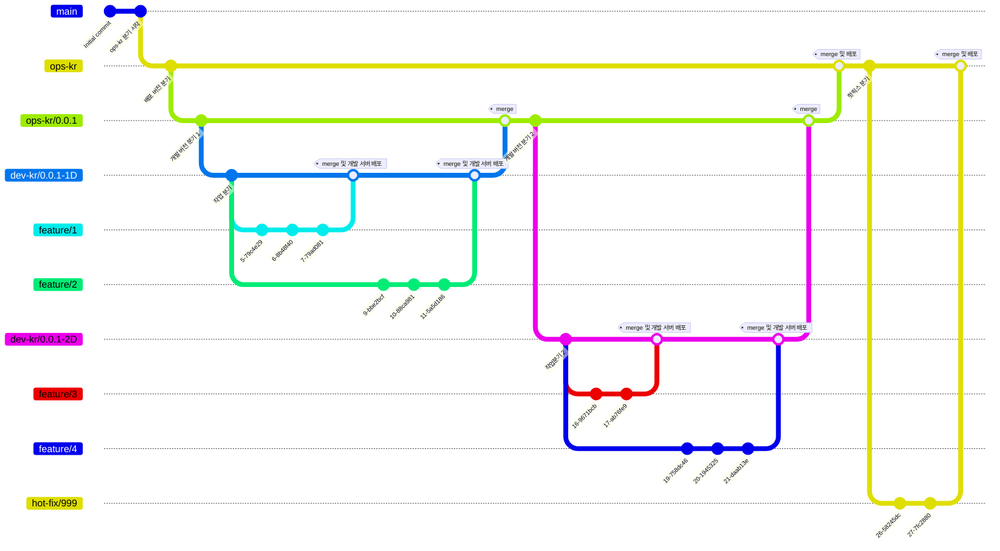

# IMS GUI v2

This is a web GUI development project for the Integrated Management System (IMS).

<br/>

## Developers

<table style="border-spacing: 20px 0px; border-collapse: separate;">
    <tr style="border: none;">
        <td align="center" style="border: none; border-radius: 10px; background-color: rgba(252, 114, 66, 0.1); padding: 10px;">
            
            <br />
            <sub>
            <b>
                유권우
            </b>
            </sub>
            <br />
                Project Leader, Developer
            <br />
            <a href="https://github.com/KingsFavor" target="_blank">
                
            </a>
        </td>
        <td align="center" style="border: none; border-radius: 10px; background-color: rgba(252, 114, 66, 0.1); padding: 10px;">
            
            <br />
            <sub>
            <b>
                이재민
            </b>
            </sub>
            <br />
                API Integration, Developer
            <br />    
            <a href="https://github.com/DancingGamza" target="_blank">
                
            </a>
        </td>
        <td align="center" style="border: none; border-radius: 10px; background-color: rgba(252, 114, 66, 0.1); padding: 10px;">
            
            <br />
            <sub>
            <b>
                박소민 
            </b>
            </sub>
            <br />
                API Integration, Developer
            <br />    
            <a href="https://github.com/somln" target="_blank">
                
            </a>
        </td>
    </tr>
</table>

<br/>

## Development Stack

[]()

<br/>

## Branch Rule

### Life Cycle




---
#### 🚩 Main

<code>main</code><br />
<sub>메인 브랜치로, 프로젝트의 기본적인 파일 트리만을 구성합니다. 해당 브랜치에 merge되는 내용은 완성된 프로젝트입니다.</sub><br />

<code>ops-kr</code><br />
<sub>국내 배포 브랜치입니다. 해당 브랜치는 <code>main</code>에 병합되지 않습니다. </sub><br />

<code>ops-us</code><br />
<sub>미국 배포 브랜치입니다. 해당 브랜치는 <code>main</code>에 병합되지 않습니다. </sub>

<br />

#### 🛫 Deploy

<code>ops-kr/0.0.0</code><br />
<sub>국내 배포 목적 배포 버전입니다. 해당 브랜치는 분기 시 <code>0.0.0</code> 에 version을 명시하고 version history를 남겨야 합니다.</sub><br />

<code>ops-us/0.0.0</code><br />
<sub>미국 배포 목적 배포 버전입니다. 해당 브랜치는 분기 시 <code>0.0.0</code> 에 version을 명시하고 version history를 남겨야 합니다.</sub>

<br />

#### 🛠️ Development

<code>dev-kr/0.0.0</code><br />
<sub>국내 <strong>개발 서버</strong> 배포 버전입니다. 해당 브랜치는 분기 시 <code>0.0.0</code> 에 ops버전을 포함한 version을 명시하고 version history를 남겨야 합니다. (예) <code>0.0.1-1D</code> : <code>ops-kr/0.0.1</code>의 <code>1D</code> 버전</sub><br />

<code>dev-us/0.0.0</code><br />
<sub>미국 <strong>개발 서버</strong> 배포 버전입니다. 해당 브랜치는 분기 시 <code>0.0.0</code> 에 ops버전을 포함한 version을 명시하고 version history를 남겨야 합니다. (예) <code>0.0.1-1D</code> : <code>ops-kr/0.0.1</code>의 <code>1D</code> 버전</sub>

<br />

#### 💻 Code

<code>feature/feature-name</code><br />
<sub>기본적인 개발 브랜치로, 개발 진행 시 <code>feature-name</code> 에 작업한 기능을 명시합니다.</sub><br />
<sub>만약 특정 이슈 또는 요구사항을 개발하였다면, <code>feature-name</code> 에 <code>#이슈넘버</code>를 명시합니다.</sub><br />

<code>hot-fix/bug-name</code><br />
<sub> 버그 핫픽스를 위한 브랜치로, <code>bug-name</code> 에 해결한 버그를 명시합니다. <code>ops</code> 브랜치에 <code>merge</code> 될 때 version history를 남겨야 합니다.</sub><br />

<code>test/test-name</code><br />
<sub> 테스트 코드 작성을 위한 브랜치로, <code>test-name</code> 에 테스트 대상을 명시합니다. <code>feature</code> 브랜치와 동일하지만, 실제 로직을 수정하지 않고, 테스트 코드만을 수정합니다. </sub><br />

<br/>

## <code>Commit</code> Convention

<br/>

- 모든 내용은 한국어 또는 영어로 작성한다.
- 제목과 본문은 명령문 형식으로 작성하며, 현재형으로 작성한다.
- 제목과 본문은 <strong>빈 행</strong>을 사이에 둔다.
- 가능하면 실제 클래스 또는 모듈 명을 명시한다. (작은 수정내용의 경우)
- 논리에 대한 설명을 제외하고, <strong>대상</strong>과 <strong>이유</strong>를 위주로 작성한다.
- 내용이 너무 길어지지 않도록 한다.
- 관련 이슈 또는 요구사항 등이 있다면 본문의 마지막에 <strong>빈 행</strong>을 두고 작성한다.

#### 예시

``` shell
git commit -m "DeleteAdapter::doDelete 메소드 작성

DeleteAdapter 모듈에서,
실제로 삭제가 수행되었을 때 호출되는 public 메소드를 작성.

issue: #002
reqs: #010
"
```

<br/>

## <code>PR</code> Convention

```text
아래 형식은 Git PR 작성 페이지의 markdown 형식입니다.
```

```markdown
### PR Type
- [ ] 기능 추가
- [ ] 기능 수정
- [x] 기능 삭제
- [ ] 버그 수정
- [ ] 의존성, 환경 변수, 빌드 관련 코드 업데이트
- [ ] 테스트 코드 작성
- [ ] 테스트 코드 수정
- [ ] 테스트 코드 삭제

### Branch Direction
ex) ```feature/3``` -> ```dev-kr/0.0.1-3D```

### Description
ex) 로그인 기능에 대한 예외 처리 로직을 반영했습니다.

### Remark / Test Issue
ex) 예외 처리 시 에러 종류에 따른 처리 로직 분리에 대한 토론 주제를 생성해두었습니다.
```
<br/>

## Co-work Places

### 브랜치 상세
[](https://www.notion.so/Git-Branch-Description-13105a0af1da8182b713e3b0c32d4401?pvs=4)

### 토의 및 피어 리뷰
[](https://www.notion.so/Peer-Review-Discussion-fe00133a5ca84a0492a465bfb13ca1c6?pvs=4)

### 개발자 매뉴얼
[](https://www.notion.so/Manuals-13105a0af1da81a0996fd9696699dd80?pvs=4)
[](https://www.notion.so/Logics-13105a0af1da8173988eeb15b03ec19c?pvs=4)

<br/>

## Issues
[](https://www.notion.so/IMSv2-Issues-14c05a0af1da802b872fdca38a15c558?pvs=4)

<br />

## Deployment

### 배포 정보 상세
[](https://www.notion.so/14c05a0af1da8098b664e7501b8735f6?pvs=4)

### 버전 관리 페이지
[](https://www.notion.so/Version-Management-14c05a0af1da80a0be8cfaf84b0c18cc?pvs=4)

<br />
